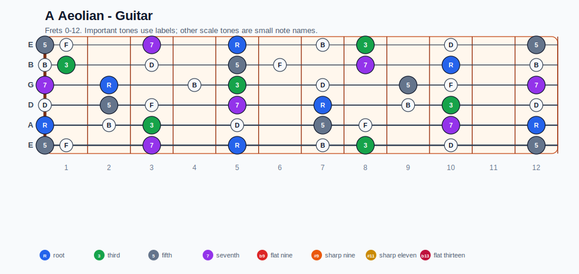
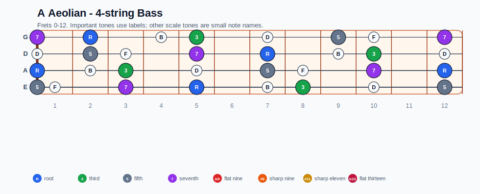
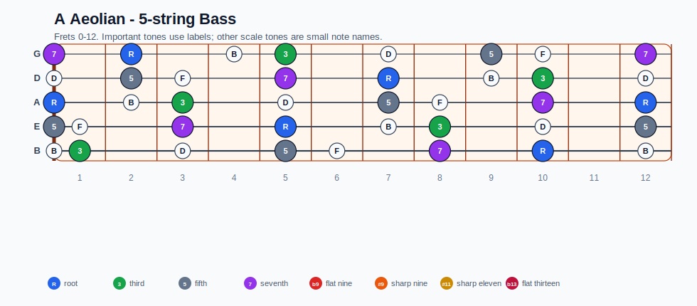
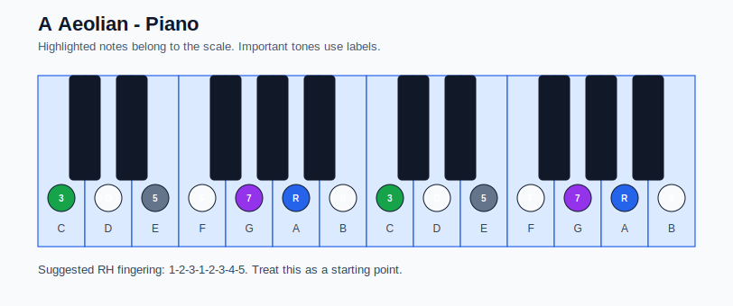

# A Aeolian Practice Sheet

## Scale

- Notes: A, B, C, D, E, F, G, A
- Chord context: Am7, Am7, Am7, Am7
- Important tones: R: A, 3: C, 5: E, 7: G

### Common tones with previous scales

- A Lydian dominant: A, B, E, G
- A Mixolydian: A, B, D, E, G
- Eb Lydian dominant: A, C, F, G
- Eb Mixolydian: C, F, G

### Common tones with next scales

- D Lydian dominant: A, B, C, D, E
- D Mixolydian: A, B, C, D, E, G

## Resolution ideas

- Use 3rds and 7ths as landing tones, then connect neighboring scale notes melodically.

## Diagrams

### Guitar fretboard

## Electric Bass

### 4-string bass

### 5-string bass

### Piano keyboard

## Piano notes

- Scale notes: A, B, C, D, E, F, G, A
- Suggested RH fingering: 1-2-3-1-2-3-4-5
- Fingering is a starting point, not a rule. Adjust it for tempo, line direction, and hand shape.
- Target tones: R: A, 3: C, 5: E, 7: G
