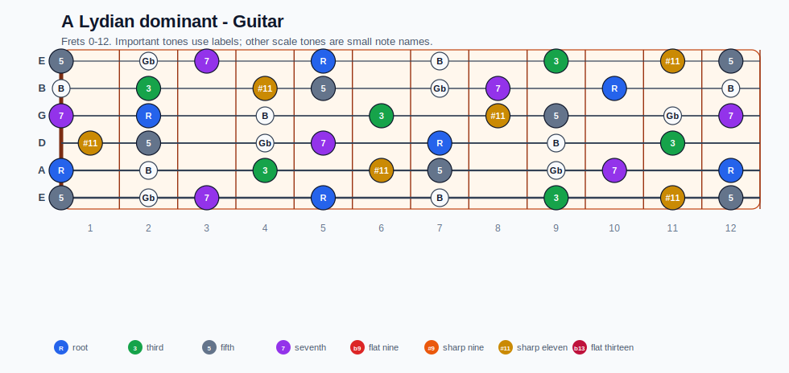
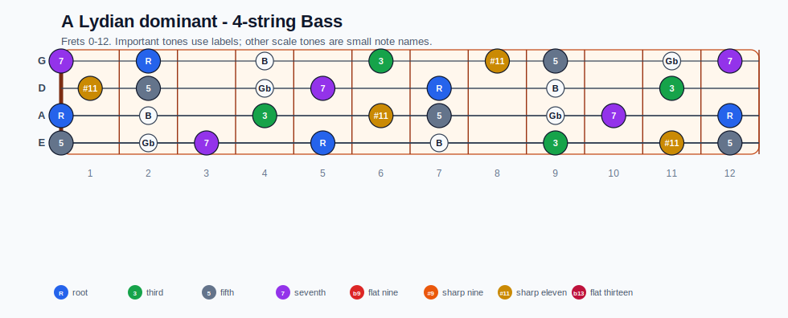
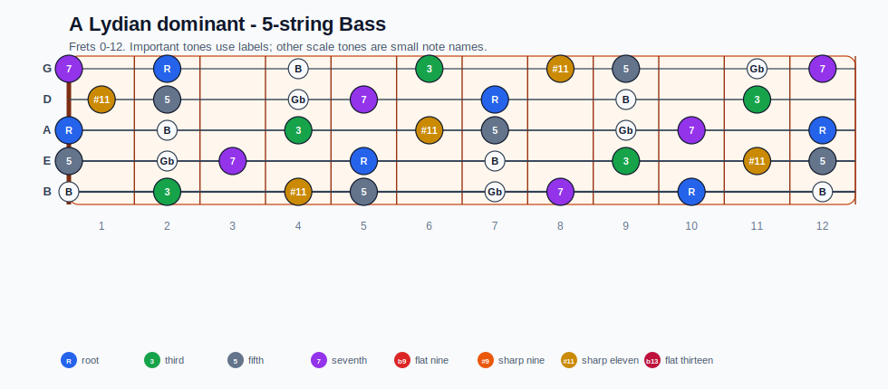
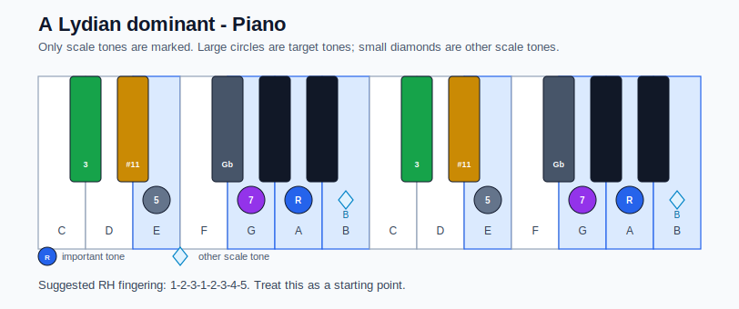

# A Lydian dominant Practice Sheet

## Scale

- Notes: A, B, Db, Eb, E, Gb, G, A
- Chord context: A7, A7, A7
- Important tones: R: A, 3: Db, 5: E, #11: Eb, 7: G

### Common tones with previous scales

- A Lydian dominant: A, B, Db, Eb, E, Gb, G
- A Mixolydian: A, B, Db, E, Gb, G
- E Aeolian: A, B, E, Gb, G
- E Dorian: A, B, Db, E, Gb, G

### Common tones with next scales

- A Aeolian: A, B, E, G
- A Dorian: A, B, E, Gb, G
- A Lydian dominant: A, B, Db, Eb, E, Gb, G
- A Mixolydian: A, B, Db, E, Gb, G

## Resolution ideas

- Lean on #11 color, then resolve the dominant guide tones smoothly.

## Diagrams

### Guitar fretboard

## Electric Bass

### 4-string bass

### 5-string bass

### Piano keyboard

## Piano notes

- Scale notes: A, B, Db, Eb, E, Gb, G, A
- Suggested RH fingering: 1-2-3-1-2-3-4-5
- Fingering is a starting point, not a rule. Adjust it for tempo, line direction, and hand shape.
- Target tones: R: A, 3: Db, 5: E, #11: Eb, 7: G
