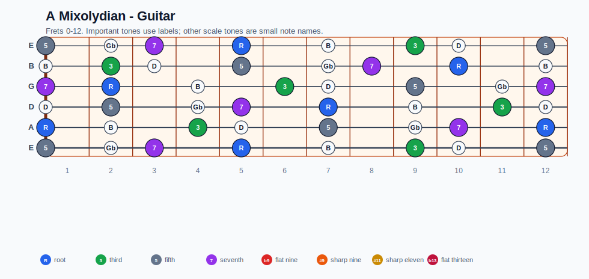
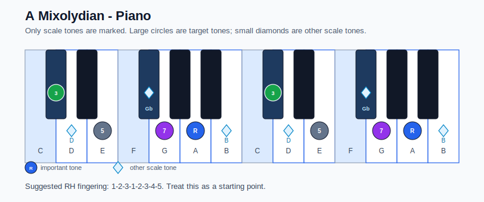

# A Mixolydian Practice Sheet

## Scale

- Notes: A, B, Db, D, E, Gb, G, A
- Chord context: A7, A7, A7
- Important tones: R: A, 3: Db, 5: E, 7: G

### Common tones with previous scales

- A Lydian dominant: A, B, Db, E, Gb, G
- A Mixolydian: A, B, Db, D, E, Gb, G
- E Aeolian: A, B, D, E, Gb, G
- E Dorian: A, B, Db, D, E, Gb, G

### Common tones with next scales

- A Aeolian: A, B, D, E, G
- A Dorian: A, B, D, E, Gb, G
- A Lydian dominant: A, B, Db, E, Gb, G
- A Mixolydian: A, B, Db, D, E, Gb, G

## Resolution ideas

- Resolve the 7th down and the 3rd toward the next chord.

## Diagrams

### Guitar fretboard

### Piano keyboard

## Piano notes

- Scale notes: A, B, Db, D, E, Gb, G, A
- Suggested RH fingering: 1-2-3-1-2-3-4-5
- Fingering is a starting point, not a rule. Adjust it for tempo, line direction, and hand shape.
- Target tones: R: A, 3: Db, 5: E, 7: G
