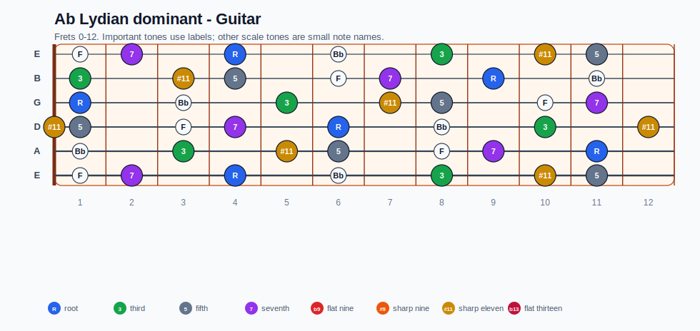
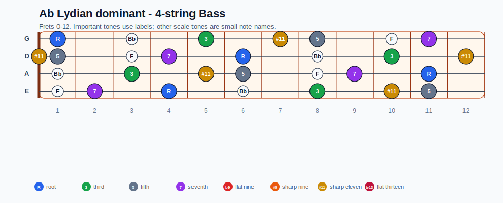
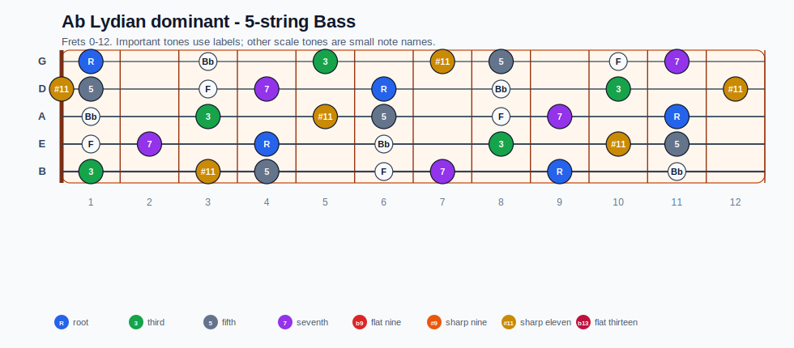
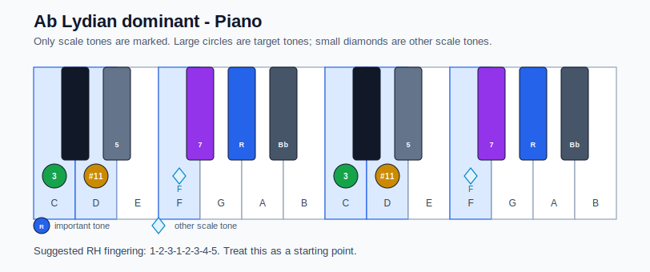

# Ab Lydian dominant Practice Sheet

## Scale

- Notes: Ab, Bb, C, D, Eb, F, Gb, Ab
- Chord context: Ab7
- Important tones: R: Ab, 3: C, #11: D, 5: Eb, 7: Gb

### Common tones with previous scales

- A Dorian: C, D, Gb

### Common tones with next scales

- G Ionian: C, D, Gb

## Resolution ideas

- Move the substitute dominant by half step into the tonic root or 5th.

## Diagrams

### Guitar fretboard

## Electric Bass

### 4-string bass

### 5-string bass

### Piano keyboard

## Piano notes

- Scale notes: Ab, Bb, C, D, Eb, F, Gb, Ab
- Suggested RH fingering: 1-2-3-1-2-3-4-5
- Fingering is a starting point, not a rule. Adjust it for tempo, line direction, and hand shape.
- Target tones: R: Ab, 3: C, #11: D, 5: Eb, 7: Gb
