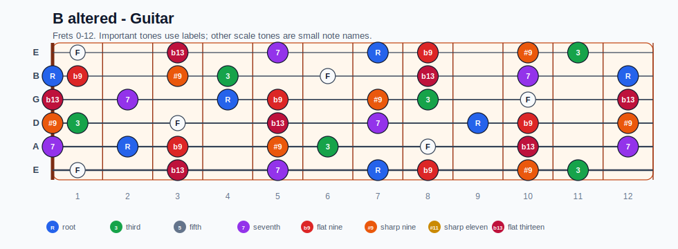
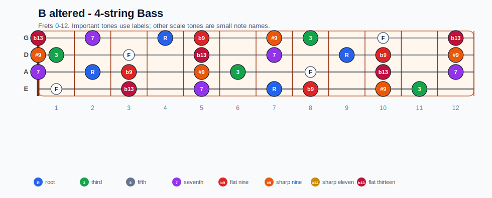
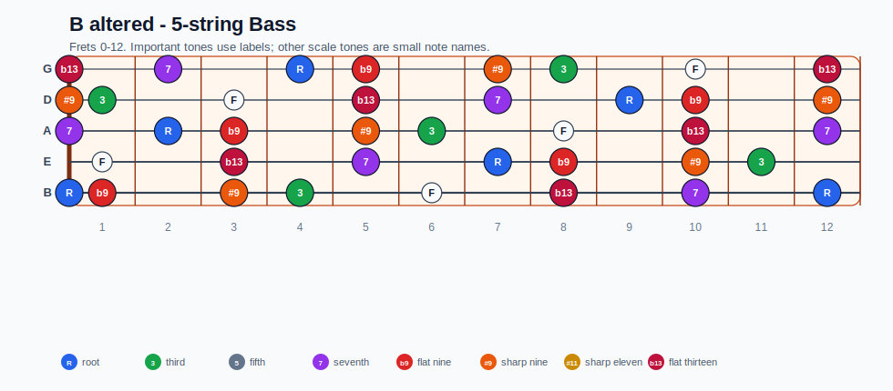
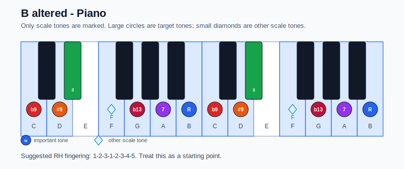

# B altered Practice Sheet

## Scale

- Notes: B, C, D, Eb, F, G, A, B
- Chord context: B7b9, B7#9
- Important tones: 7: A, R: B, b9: C, #9: D, 3: Eb, b13: G

### Common tones with previous scales

- Gb Locrian: B, C, D, G, A
- Gb Locrian natural 2: B, C, D, A

### Common tones with next scales

- E Aeolian: B, C, D, G, A
- E Dorian: B, D, G, A

## Resolution ideas

- Aim altered color tones by half step into stable tones on the next chord.
- Resolve #9/b9 colors by half step into stable chord tones on the tonic.

## Diagrams

### Guitar fretboard

## Electric Bass

### 4-string bass

### 5-string bass

### Piano keyboard

## Piano notes

- Scale notes: B, C, D, Eb, F, G, A, B
- Suggested RH fingering: 1-2-3-1-2-3-4-5
- Fingering is a starting point, not a rule. Adjust it for tempo, line direction, and hand shape.
- Target tones: 7: A, R: B, b9: C, #9: D, 3: Eb, b13: G
