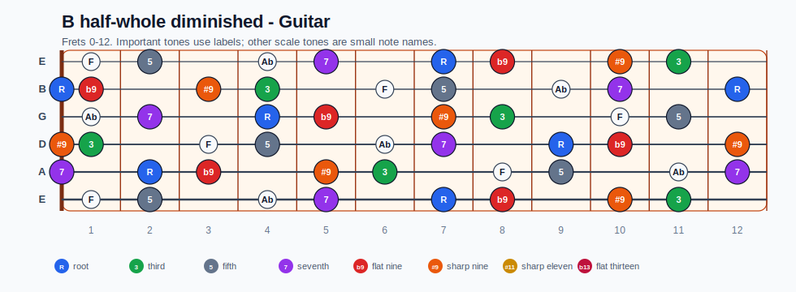
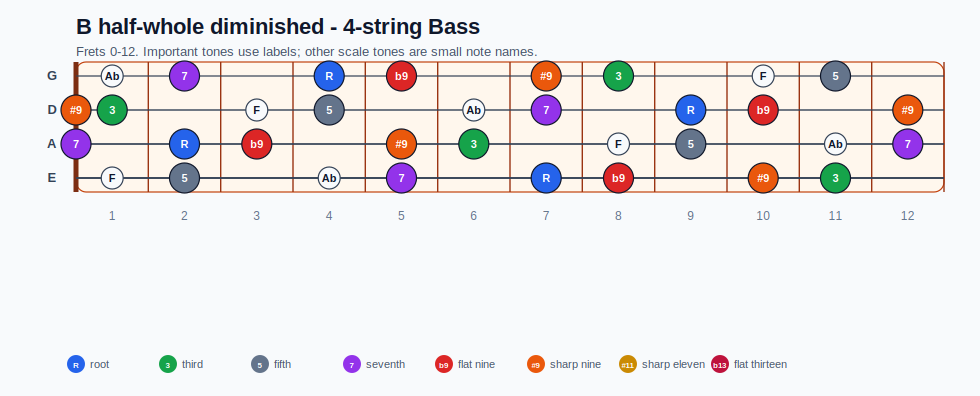
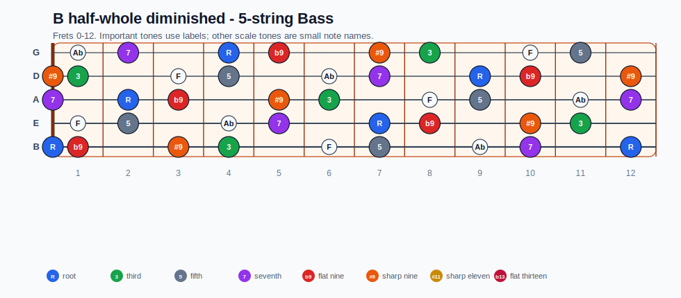
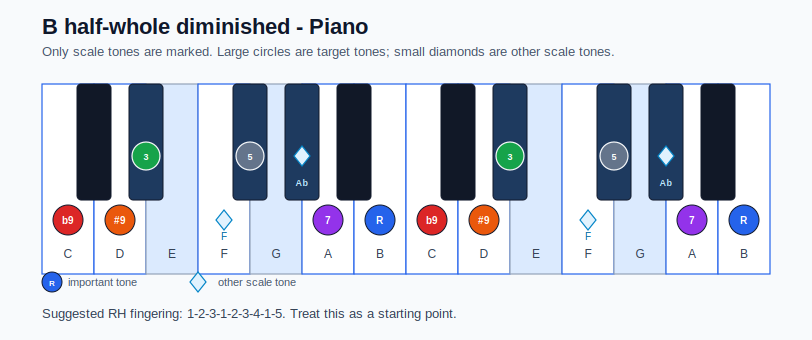

# B half-whole diminished Practice Sheet

## Scale

- Notes: B, C, C##, D#, E#, F#, G#, A, B
- Chord context: B7b9
- Important tones: 7: A, R: B, b9: C, #9: C##, 3: D#, 5: F#

### Common tones with previous scales

- F# Locrian: B, C, C##, F#, A
- F# Locrian natural 2: B, C, C##, F#, G#, A

### Common tones with next scales

- E Aeolian: B, C, C##, F#, A
- E Dorian: B, C##, F#, A

## Resolution ideas

- Use b9 and diminished passing tones as tension, then land on tonic chord tones.
- Use diminished color tones as passing tension, then resolve to chord tones.

## Diagrams

### Guitar fretboard

## Electric Bass

### 4-string bass

### 5-string bass

### Piano keyboard

## Piano notes

- Scale notes: B, C, C##, D#, E#, F#, G#, A, B
- Suggested RH fingering: 1-2-3-1-2-3-4-1-5
- Fingering is a starting point, not a rule. Adjust it for tempo, line direction, and hand shape.
- Target tones: 7: A, R: B, b9: C, #9: C##, 3: D#, 5: F#
