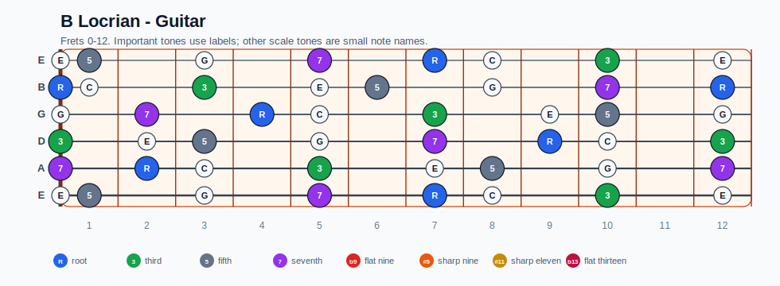
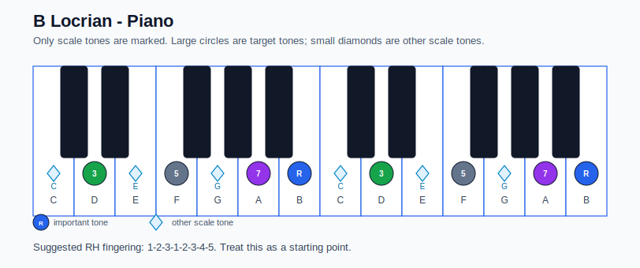

# B Locrian Practice Sheet

## Scale

- Notes: B, C, D, E, F, G, A, B
- Chord context: Bm7b5
- Important tones: 7: A, R: B, 3: D, 5: F

### Common tones with previous scales

- F Ionian: C, D, E, F, G, A
- F Lydian: B, C, D, E, F, G, A

### Common tones with next scales

- Bb Lydian dominant: C, D, E, F, G
- E altered: C, D, E, F, G
- E half-whole diminished: B, D, E, F, G
- E phrygian dominant: B, C, D, E, F, A

## Resolution ideas

- Use 3rds and 7ths as landing tones, then connect neighboring scale notes melodically.

## Diagrams

### Guitar fretboard

### Piano keyboard

## Piano notes

- Scale notes: B, C, D, E, F, G, A, B
- Suggested RH fingering: 1-2-3-1-2-3-4-5
- Fingering is a starting point, not a rule. Adjust it for tempo, line direction, and hand shape.
- Target tones: 7: A, R: B, 3: D, 5: F
