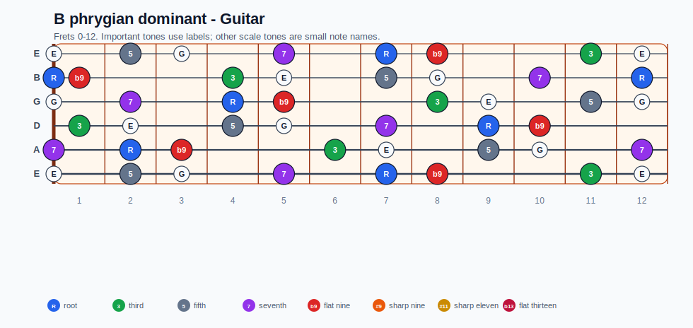
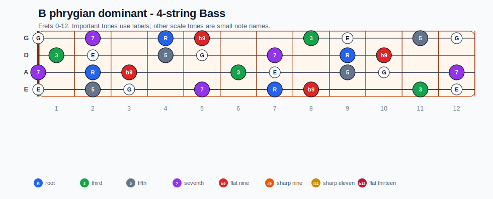
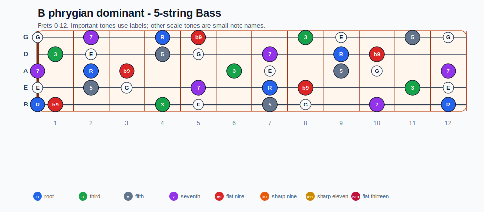
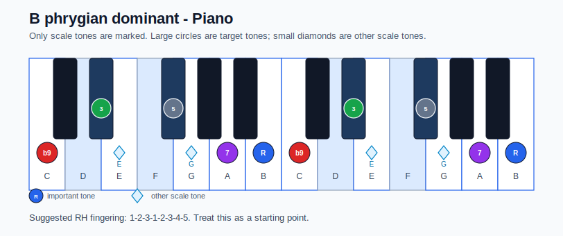

# B phrygian dominant Practice Sheet

## Scale

- Notes: B, C, Eb, E, Gb, G, A, B
- Chord context: B7b9
- Important tones: 7: A, R: B, b9: C, 3: Eb, 5: Gb

### Common tones with previous scales

- Gb Locrian: B, C, E, Gb, G, A
- Gb Locrian natural 2: B, C, E, Gb, A

### Common tones with next scales

- E Aeolian: B, C, E, Gb, G, A
- E Dorian: B, E, Gb, G, A

## Resolution ideas

- Keep guide tones clear: the dominant 7th resolves down, and the dominant 3rd resolves toward the tonic.
- Treat b9 as a strong pull into the minor tonic sound.

## Diagrams

### Guitar fretboard

## Electric Bass

### 4-string bass

### 5-string bass

### Piano keyboard

## Piano notes

- Scale notes: B, C, Eb, E, Gb, G, A, B
- Suggested RH fingering: 1-2-3-1-2-3-4-5
- Fingering is a starting point, not a rule. Adjust it for tempo, line direction, and hand shape.
- Target tones: 7: A, R: B, b9: C, 3: Eb, 5: Gb
