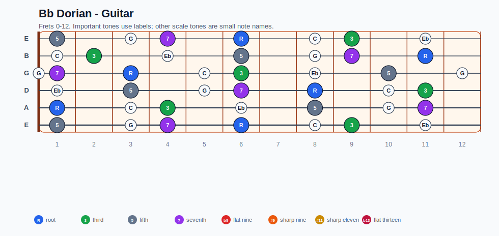
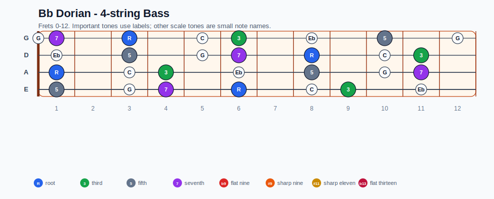
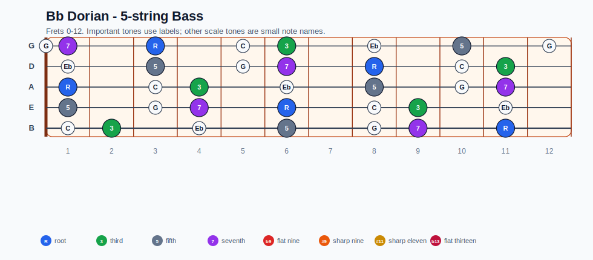
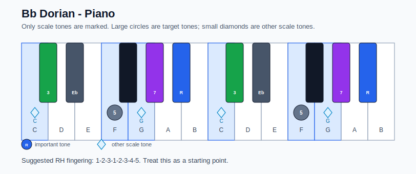

# Bb Dorian Practice Sheet

## Scale

- Notes: Bb, C, Db, Eb, F, G, Ab, Bb
- Chord context: Bbm7, Bbm7
- Important tones: 7: Ab, R: Bb, 3: Db, 5: F

### Common tones with previous scales

- G Ionian: C, G
- G Lydian: Db, G

### Common tones with next scales

- Eb Lydian dominant: Bb, C, Db, Eb, F, G
- Eb Mixolydian: Bb, C, Db, Eb, F, G, Ab

## Resolution ideas

- Use 3rds and 7ths as landing tones, then connect neighboring scale notes melodically.

## Diagrams

### Guitar fretboard

## Electric Bass

### 4-string bass

### 5-string bass

### Piano keyboard

## Piano notes

- Scale notes: Bb, C, Db, Eb, F, G, Ab, Bb
- Suggested RH fingering: 1-2-3-1-2-3-4-5
- Fingering is a starting point, not a rule. Adjust it for tempo, line direction, and hand shape.
- Target tones: 7: Ab, R: Bb, 3: Db, 5: F
