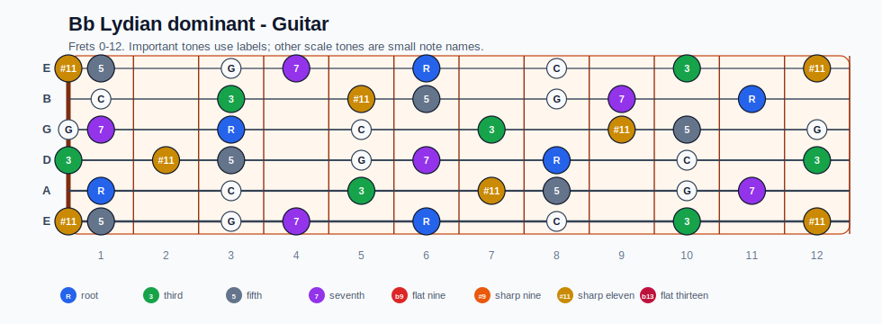
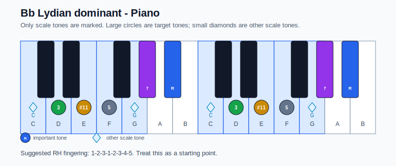

# Bb Lydian dominant Practice Sheet

## Scale

- Notes: Bb, C, D, E, F, G, Ab, Bb
- Chord context: Bb7
- Important tones: 7: Ab, R: Bb, 3: D, #11: E, 5: F

### Common tones with previous scales

- B Locrian: C, D, E, F, G

### Common tones with next scales

- A Dorian: C, D, E, G

## Resolution ideas

- Move the substitute dominant by half step into the tonic root or 5th.

## Diagrams

### Guitar fretboard

### Piano keyboard

## Piano notes

- Scale notes: Bb, C, D, E, F, G, Ab, Bb
- Suggested RH fingering: 1-2-3-1-2-3-4-5
- Fingering is a starting point, not a rule. Adjust it for tempo, line direction, and hand shape.
- Target tones: 7: Ab, R: Bb, 3: D, #11: E, 5: F
