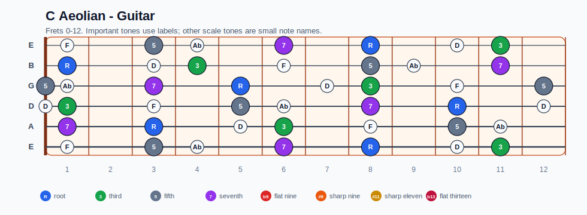
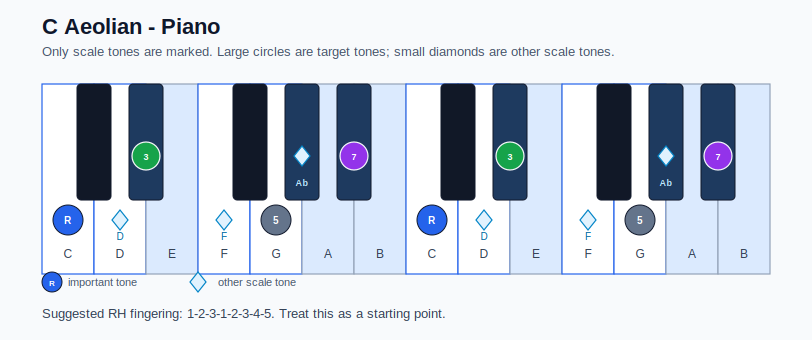

# C Aeolian Practice Sheet

## Scale

- Notes: C, D, Eb, F, G, Ab, Bb, C
- Chord context: Cm7, Cm7
- Important tones: 7: Bb, R: C, 3: Eb, 5: G

### Common tones with previous scales

- C Ionian: C, D, F, G
- C Lydian: C, D, G

### Common tones with next scales

- F Lydian dominant: C, D, Eb, F, G
- F Mixolydian: C, D, Eb, F, G, Bb

## Resolution ideas

- Use 3rds and 7ths as landing tones, then connect neighboring scale notes melodically.

## Diagrams

### Guitar fretboard

### Piano keyboard

## Piano notes

- Scale notes: C, D, Eb, F, G, Ab, Bb, C
- Suggested RH fingering: 1-2-3-1-2-3-4-5
- Fingering is a starting point, not a rule. Adjust it for tempo, line direction, and hand shape.
- Target tones: 7: Bb, R: C, 3: Eb, 5: G
