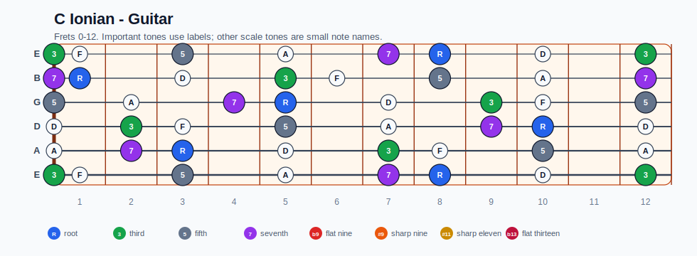
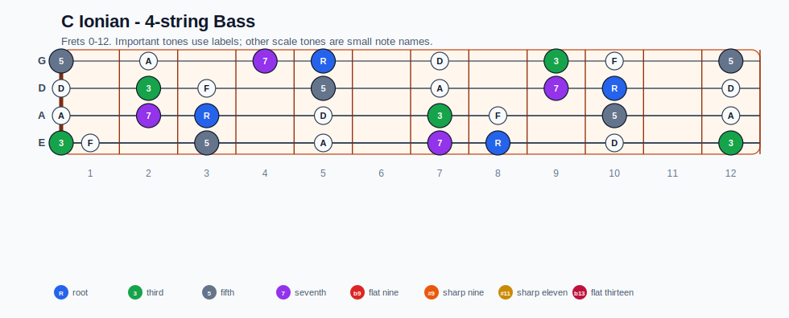
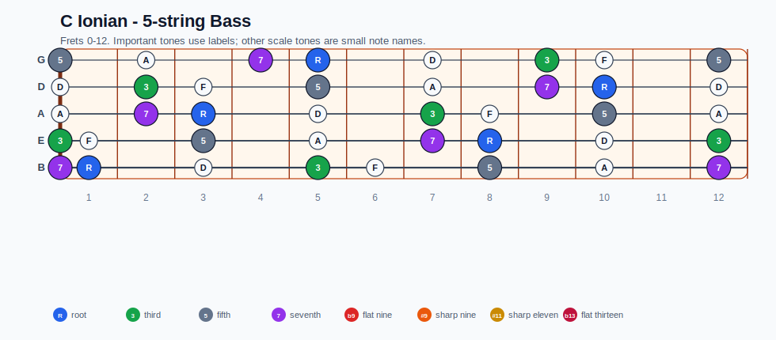
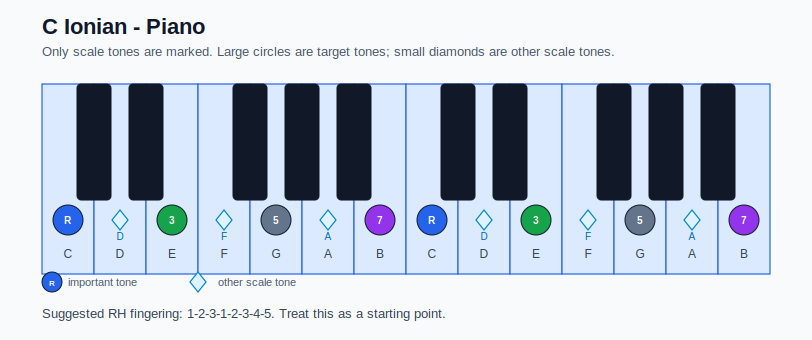

# C Ionian Practice Sheet

## Scale

- Notes: C, D, E, F, G, A, B, C
- Chord context: Cmaj7, Cmaj7, Cmaj7, Cmaj7
- Important tones: 7: B, R: C, 3: E, 5: G

### Common tones with previous scales

- C Ionian: C, D, E, F, G, A, B
- C Lydian: C, D, E, G, A, B
- Db Lydian dominant: F, G, B
- G Lydian dominant: D, E, F, G, A, B
- G Mixolydian: C, D, E, F, G, A, B
- G altered: F, G, B
- G half-whole diminished: D, E, F, G, B

### Common tones with next scales

- C Aeolian: C, D, F, G
- C Dorian: C, D, F, G, A
- C Ionian: C, D, E, F, G, A, B
- C Lydian: C, D, E, G, A, B

## Resolution ideas

- Use 3rds and 7ths as landing tones, then connect neighboring scale notes melodically.

## Diagrams

### Guitar fretboard

## Electric Bass

### 4-string bass

### 5-string bass

### Piano keyboard

## Piano notes

- Scale notes: C, D, E, F, G, A, B, C
- Suggested RH fingering: 1-2-3-1-2-3-4-5
- Fingering is a starting point, not a rule. Adjust it for tempo, line direction, and hand shape.
- Target tones: 7: B, R: C, 3: E, 5: G
