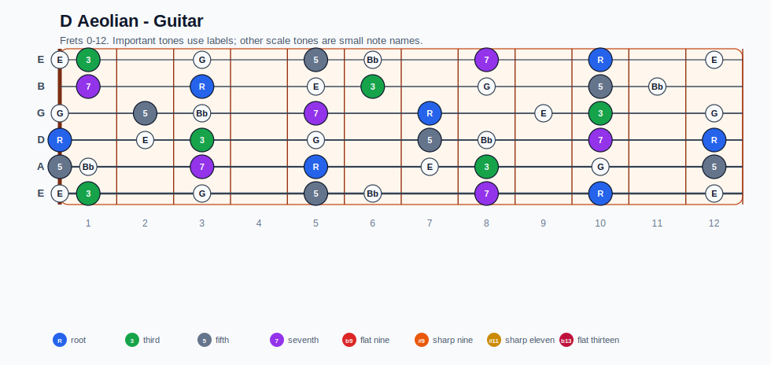
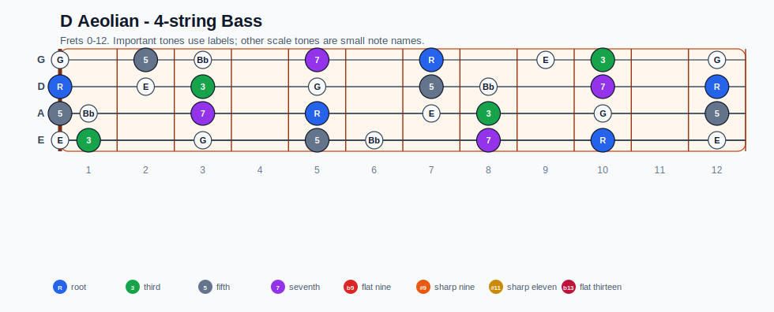
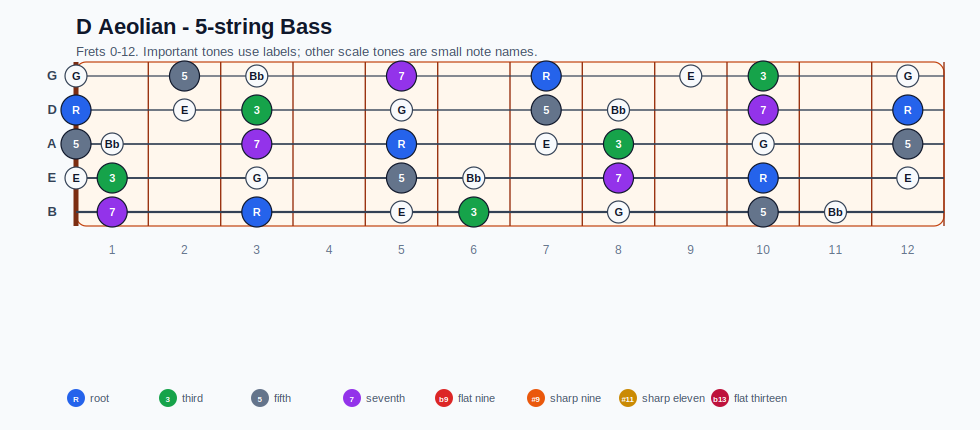
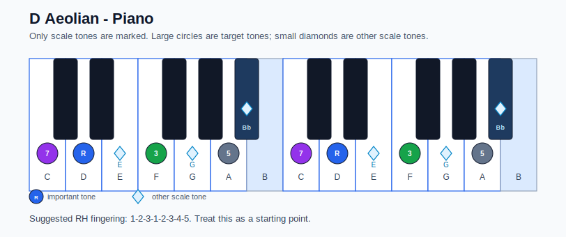

# D Aeolian Practice Sheet

## Scale

- Notes: D, E, F, G, A, Bb, C, D
- Chord context: Dm7, Dm7
- Important tones: 5: A, 7: C, R: D, 3: F

### Common tones with previous scales

- D Lydian dominant: D, E, A, C
- D Mixolydian: D, E, G, A, C
- G Ionian: D, E, G, A, C
- G Lydian: D, E, G, A

### Common tones with next scales

- G Lydian dominant: D, E, F, G, A
- G Mixolydian: D, E, F, G, A, C

## Resolution ideas

- Use 3rds and 7ths as landing tones, then connect neighboring scale notes melodically.

## Diagrams

### Guitar fretboard

## Electric Bass

### 4-string bass

### 5-string bass

### Piano keyboard

## Piano notes

- Scale notes: D, E, F, G, A, Bb, C, D
- Suggested RH fingering: 1-2-3-1-2-3-4-5
- Fingering is a starting point, not a rule. Adjust it for tempo, line direction, and hand shape.
- Target tones: 5: A, 7: C, R: D, 3: F
