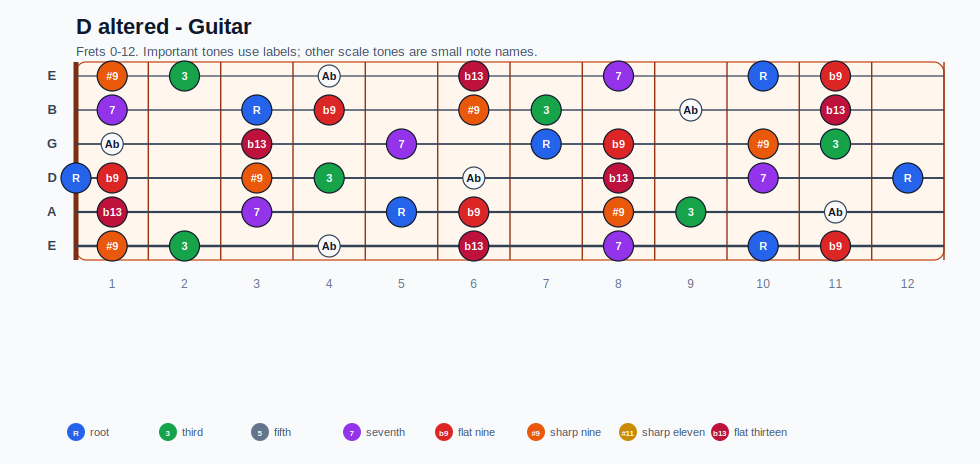
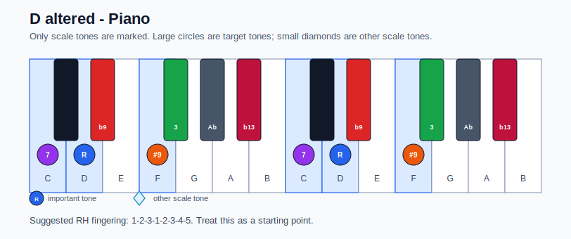

# D altered Practice Sheet

## Scale

- Notes: D, Eb, F, Gb, Ab, Bb, C, D
- Chord context: D7#9
- Important tones: b13: Bb, 7: C, R: D, b9: Eb, #9: F, 3: Gb

### Common tones with previous scales

- A Dorian: D, Gb, C

### Common tones with next scales

- G Ionian: D, Gb, C

## Resolution ideas

- Resolve #9/b9 colors by half step into stable chord tones on the tonic.

## Diagrams

### Guitar fretboard

### Piano keyboard

## Piano notes

- Scale notes: D, Eb, F, Gb, Ab, Bb, C, D
- Suggested RH fingering: 1-2-3-1-2-3-4-5
- Fingering is a starting point, not a rule. Adjust it for tempo, line direction, and hand shape.
- Target tones: b13: Bb, 7: C, R: D, b9: Eb, #9: F, 3: Gb
