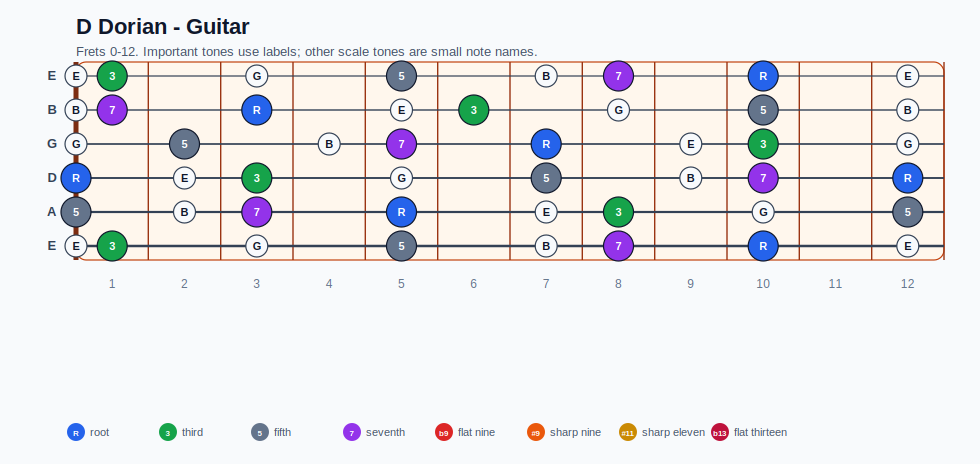
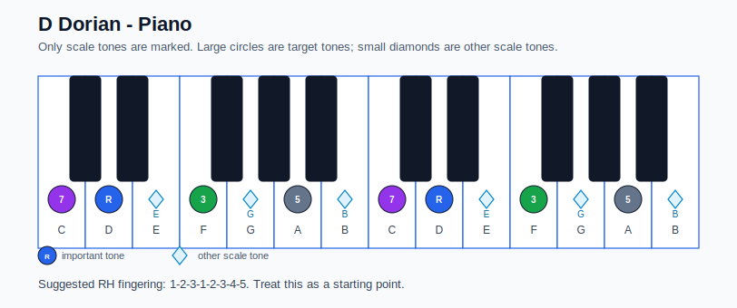

# D Dorian Practice Sheet

## Scale

- Notes: D, E, F, G, A, B, C, D
- Chord context: Dm7
- Important tones: 5: A, 7: C, R: D, 3: F

### Common tones with previous scales

No neighboring scale context found.

### Common tones with next scales

- Db Lydian dominant: F, G, B
- G Lydian dominant: D, E, F, G, A, B
- G Mixolydian: D, E, F, G, A, B, C
- G altered: F, G, B
- G half-whole diminished: D, E, F, G, B

## Resolution ideas

- Use 3rds and 7ths as landing tones, then connect neighboring scale notes melodically.

## Diagrams

### Guitar fretboard

### Piano keyboard

## Piano notes

- Scale notes: D, E, F, G, A, B, C, D
- Suggested RH fingering: 1-2-3-1-2-3-4-5
- Fingering is a starting point, not a rule. Adjust it for tempo, line direction, and hand shape.
- Target tones: 5: A, 7: C, R: D, 3: F
