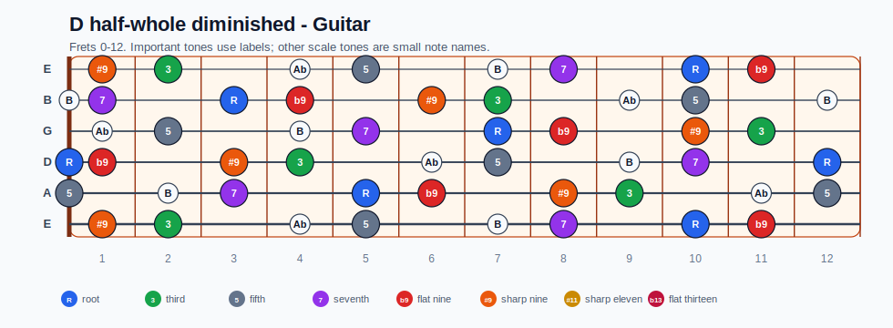
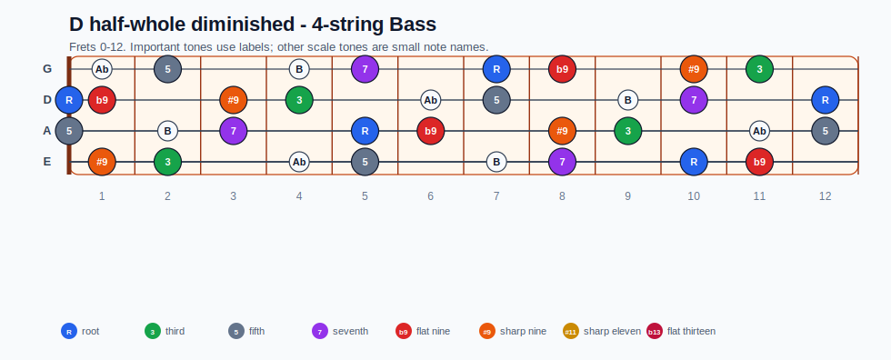
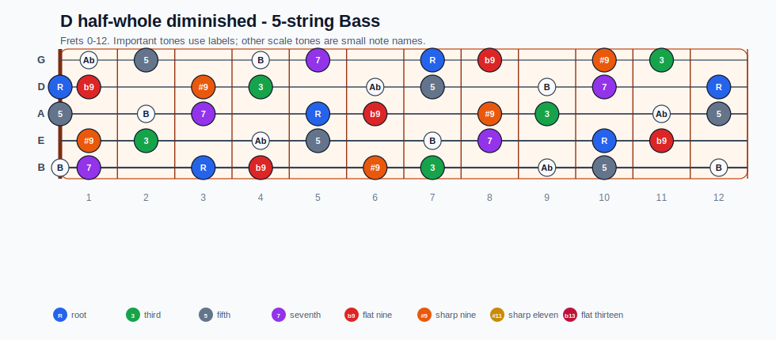
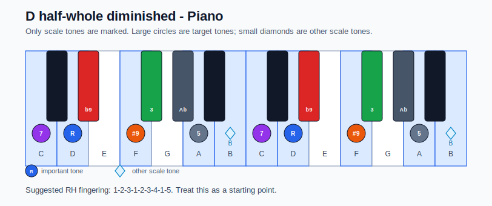

# D half-whole diminished Practice Sheet

## Scale

- Notes: D, Eb, E#, F#, G#, A, B, C, D
- Chord context: D7b9
- Important tones: 5: A, 7: C, R: D, #9: E#, b9: Eb, 3: F#

### Common tones with previous scales

- A Dorian: D, F#, A, B, C

### Common tones with next scales

- G Ionian: D, F#, A, B, C

## Resolution ideas

- Use b9 and diminished passing tones as tension, then land on tonic chord tones.

## Diagrams

### Guitar fretboard

## Electric Bass

### 4-string bass

### 5-string bass

### Piano keyboard

## Piano notes

- Scale notes: D, Eb, E#, F#, G#, A, B, C, D
- Suggested RH fingering: 1-2-3-1-2-3-4-1-5
- Fingering is a starting point, not a rule. Adjust it for tempo, line direction, and hand shape.
- Target tones: 5: A, 7: C, R: D, #9: E#, b9: Eb, 3: F#
