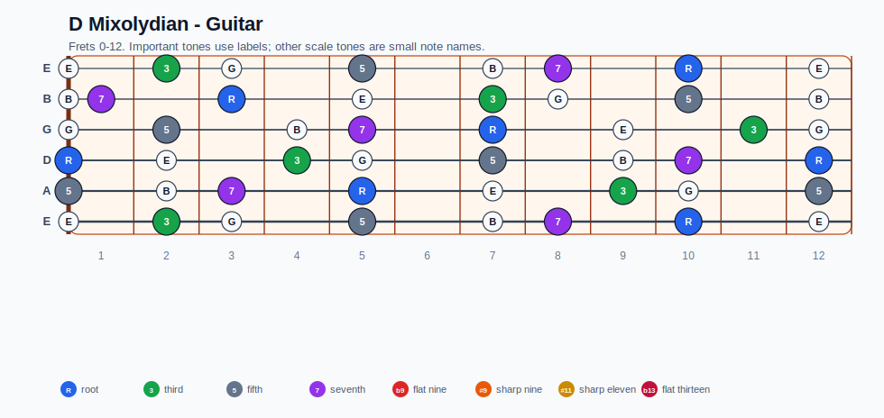
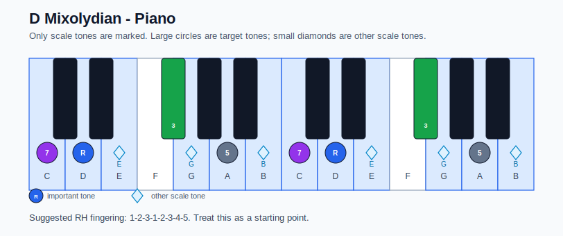

# D Mixolydian Practice Sheet

## Scale

- Notes: D, E, Gb, G, A, B, C, D
- Chord context: D7, D7, D7, D7
- Important tones: 5: A, 7: C, R: D, 3: Gb

### Common tones with previous scales

- A Aeolian: D, E, G, A, B, C
- A Dorian: D, E, Gb, G, A, B, C

### Common tones with next scales

- D Aeolian: D, E, G, A, C
- D Dorian: D, E, G, A, B, C
- G Ionian: D, E, Gb, G, A, B, C
- G Lydian: D, E, Gb, G, A, B
- Gb Locrian: D, E, Gb, G, A, B, C
- Gb Locrian natural 2: D, E, Gb, A, B, C

## Resolution ideas

- Keep guide tones clear: the dominant 7th resolves down, and the dominant 3rd resolves toward the tonic.
- Resolve the 7th down and the 3rd toward the next chord.

## Diagrams

### Guitar fretboard

### Piano keyboard

## Piano notes

- Scale notes: D, E, Gb, G, A, B, C, D
- Suggested RH fingering: 1-2-3-1-2-3-4-5
- Fingering is a starting point, not a rule. Adjust it for tempo, line direction, and hand shape.
- Target tones: 5: A, 7: C, R: D, 3: Gb
