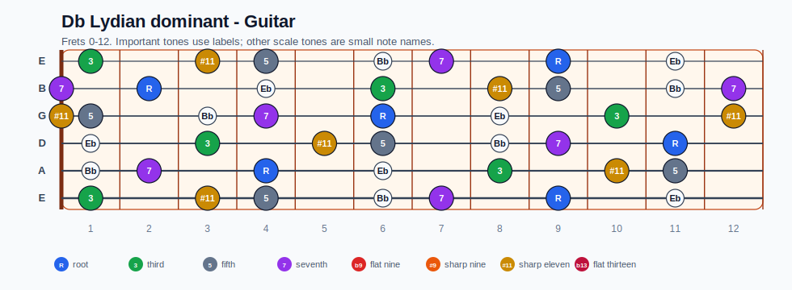
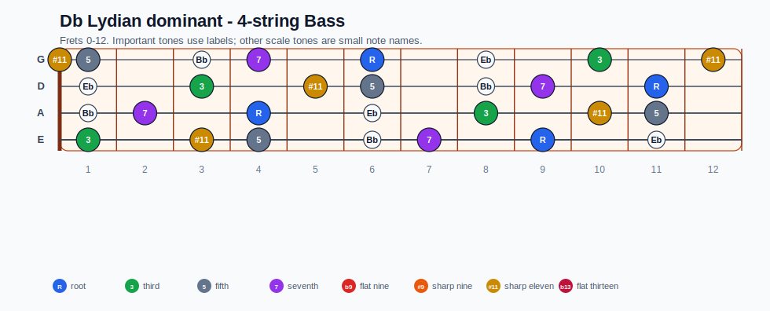
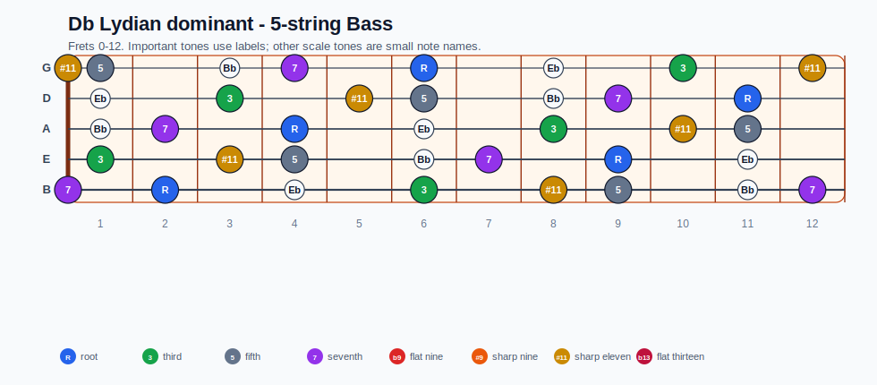
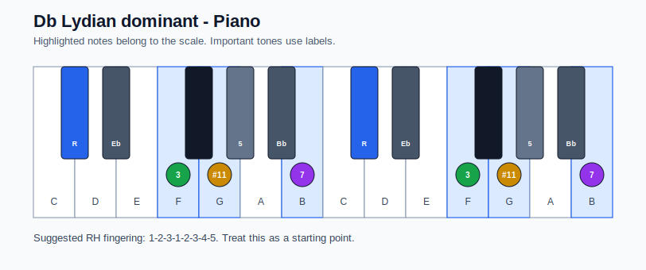

# Db Lydian dominant Practice Sheet

## Scale

- Notes: Db, Eb, F, G, Ab, Bb, Cb, Db
- Chord context: Db7
- Important tones: 5: Ab, 7: Cb, R: Db, 3: F, #11: G

### Common tones with previous scales

- D Dorian: F, G, Cb

### Common tones with next scales

- C Ionian: F, G, Cb

## Resolution ideas

- Move the substitute dominant by half step into the tonic root or 5th.

## Diagrams

### Guitar fretboard

## Electric Bass

### 4-string bass

### 5-string bass

### Piano keyboard

## Piano notes

- Scale notes: Db, Eb, F, G, Ab, Bb, Cb, Db
- Suggested RH fingering: 1-2-3-1-2-3-4-5
- Fingering is a starting point, not a rule. Adjust it for tempo, line direction, and hand shape.
- Target tones: 5: Ab, 7: Cb, R: Db, 3: F, #11: G
