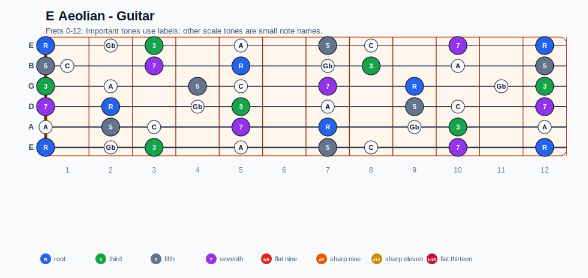
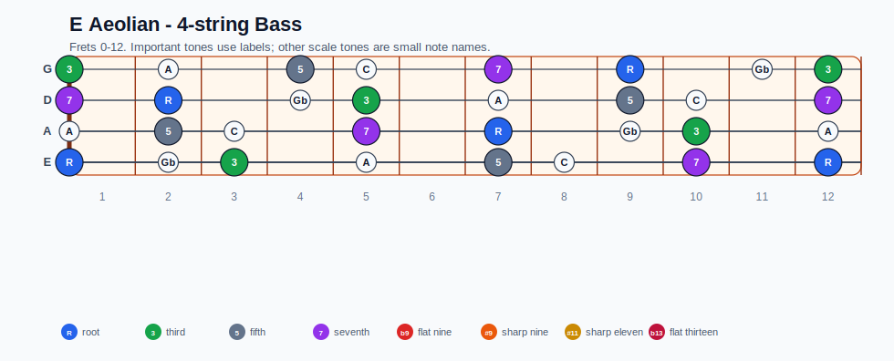
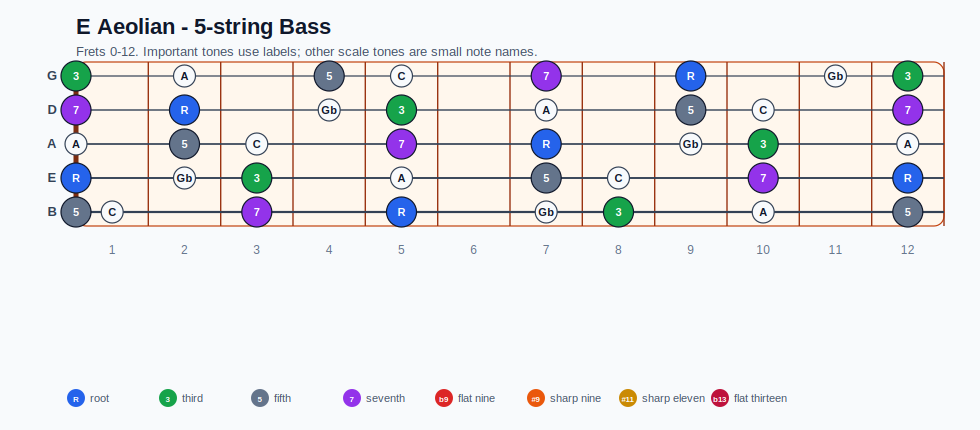
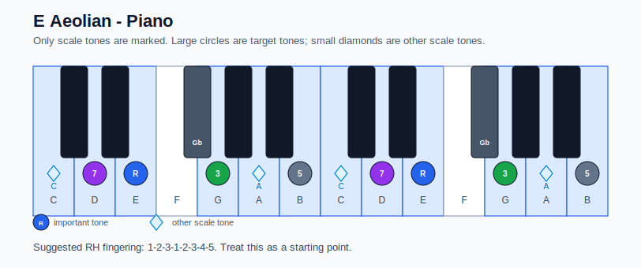

# E Aeolian Practice Sheet

## Scale

- Notes: E, F#, G, A, B, C, D, E
- Chord context: Em7, Em7
- Important tones: 5: B, 7: D, R: E, 3: G

### Common tones with previous scales

- B altered: G, A, B, C, D
- B half-whole diminished: F#, A, B, C, D
- B phrygian dominant: E, F#, G, A, B, C
- G Ionian: E, F#, G, A, B, C, D
- G Lydian: E, F#, G, A, B, D

### Common tones with next scales

- A Lydian dominant: E, F#, G, A, B
- A Mixolydian: E, F#, G, A, B, D

## Resolution ideas

- Use 3rds and 7ths as landing tones, then connect neighboring scale notes melodically.

## Diagrams

### Guitar fretboard

## Electric Bass

### 4-string bass

### 5-string bass

### Piano keyboard

## Piano notes

- Scale notes: E, F#, G, A, B, C, D, E
- Suggested RH fingering: 1-2-3-1-2-3-4-5
- Fingering is a starting point, not a rule. Adjust it for tempo, line direction, and hand shape.
- Target tones: 5: B, 7: D, R: E, 3: G
