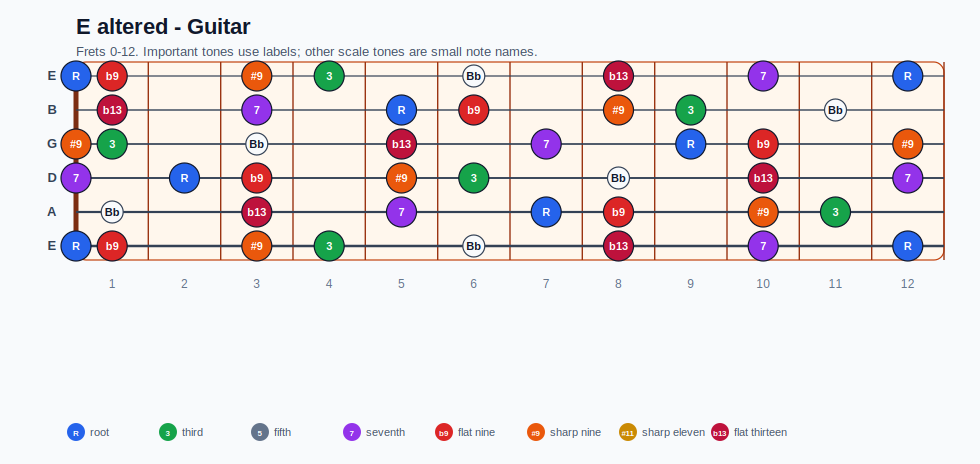
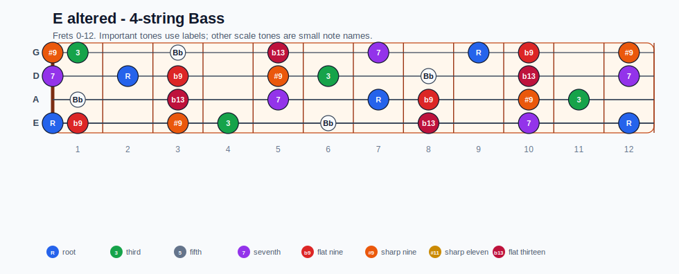
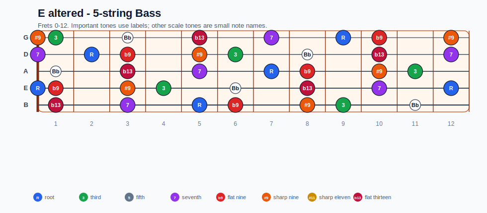
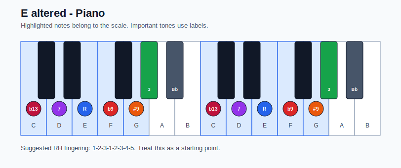

# E altered Practice Sheet

## Scale

- Notes: E, F, G, Ab, Bb, C, D, E
- Chord context: E7b9, E7#9
- Important tones: 3: Ab, b13: C, 7: D, R: E, b9: F, #9: G

### Common tones with previous scales

- B Locrian: E, F, G, C, D
- B Locrian natural 2: E, F, G, D

### Common tones with next scales

- A Aeolian: E, F, G, C, D
- A Dorian: E, G, C, D

## Resolution ideas

- Aim altered color tones by half step into stable tones on the next chord.
- Resolve #9/b9 colors by half step into stable chord tones on the tonic.

## Diagrams

### Guitar fretboard

## Electric Bass

### 4-string bass

### 5-string bass

### Piano keyboard

## Piano notes

- Scale notes: E, F, G, Ab, Bb, C, D, E
- Suggested RH fingering: 1-2-3-1-2-3-4-5
- Fingering is a starting point, not a rule. Adjust it for tempo, line direction, and hand shape.
- Target tones: 3: Ab, b13: C, 7: D, R: E, b9: F, #9: G
