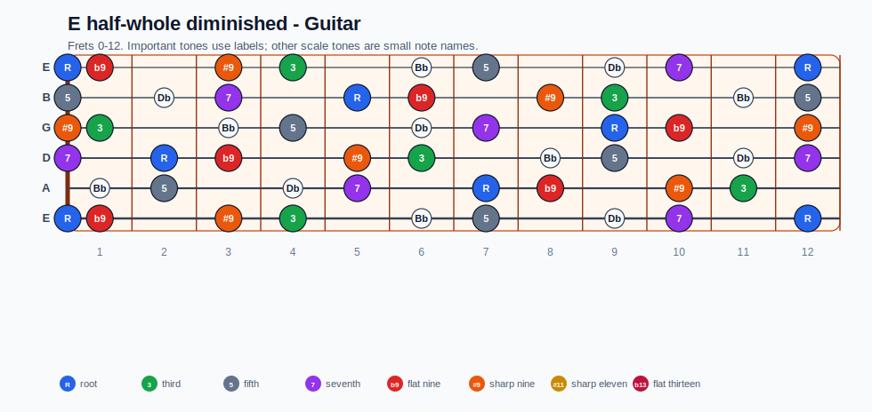
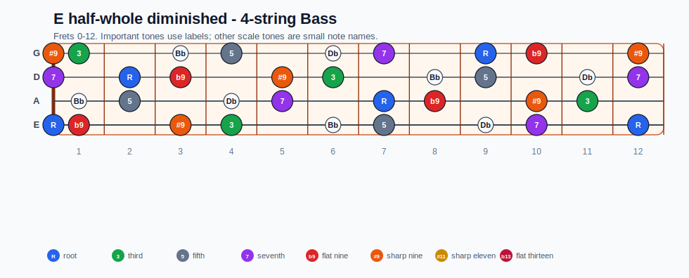
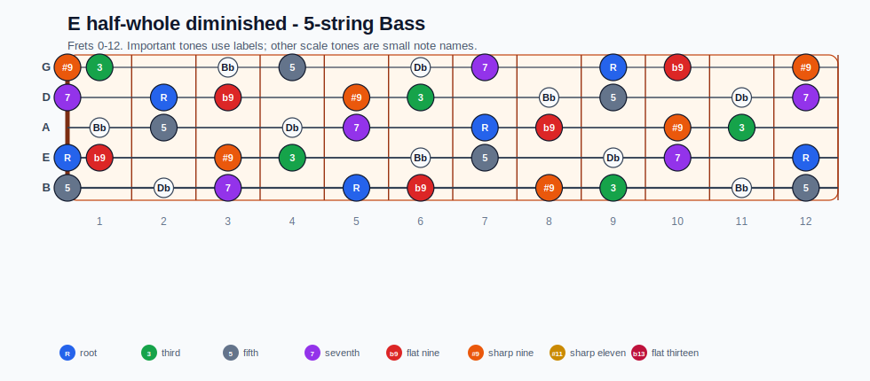
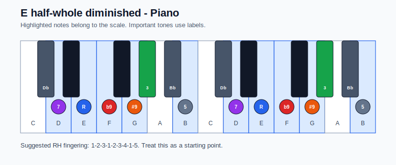

# E half-whole diminished Practice Sheet

## Scale

- Notes: E, F, F##, G#, A#, B, C#, D, E
- Chord context: E7b9
- Important tones: 5: B, 7: D, R: E, b9: F, #9: F##, 3: G#

### Common tones with previous scales

- B Locrian: E, F, F##, B, D
- B Locrian natural 2: E, F, F##, B, C#, D

### Common tones with next scales

- A Aeolian: E, F, F##, B, D
- A Dorian: E, F##, B, D

## Resolution ideas

- Use b9 and diminished passing tones as tension, then land on tonic chord tones.
- Use diminished color tones as passing tension, then resolve to chord tones.

## Diagrams

### Guitar fretboard

## Electric Bass

### 4-string bass

### 5-string bass

### Piano keyboard

## Piano notes

- Scale notes: E, F, F##, G#, A#, B, C#, D, E
- Suggested RH fingering: 1-2-3-1-2-3-4-1-5
- Fingering is a starting point, not a rule. Adjust it for tempo, line direction, and hand shape.
- Target tones: 5: B, 7: D, R: E, b9: F, #9: F##, 3: G#
