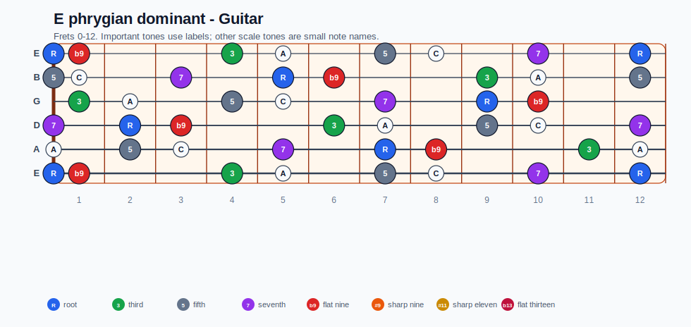
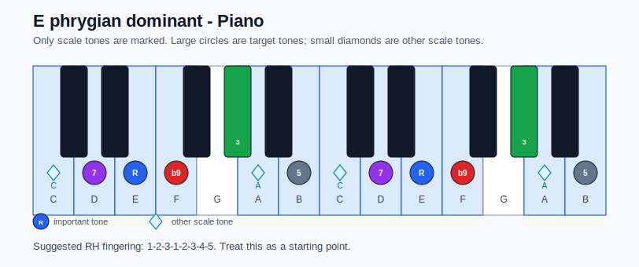

# E phrygian dominant Practice Sheet

## Scale

- Notes: E, F, Ab, A, B, C, D, E
- Chord context: E7b9
- Important tones: 3: Ab, 5: B, 7: D, R: E, b9: F

### Common tones with previous scales

- B Locrian: E, F, A, B, C, D
- B Locrian natural 2: E, F, A, B, D

### Common tones with next scales

- A Aeolian: E, F, A, B, C, D
- A Dorian: E, A, B, C, D

## Resolution ideas

- Keep guide tones clear: the dominant 7th resolves down, and the dominant 3rd resolves toward the tonic.
- Treat b9 as a strong pull into the minor tonic sound.

## Diagrams

### Guitar fretboard

### Piano keyboard

## Piano notes

- Scale notes: E, F, Ab, A, B, C, D, E
- Suggested RH fingering: 1-2-3-1-2-3-4-5
- Fingering is a starting point, not a rule. Adjust it for tempo, line direction, and hand shape.
- Target tones: 3: Ab, 5: B, 7: D, R: E, b9: F
