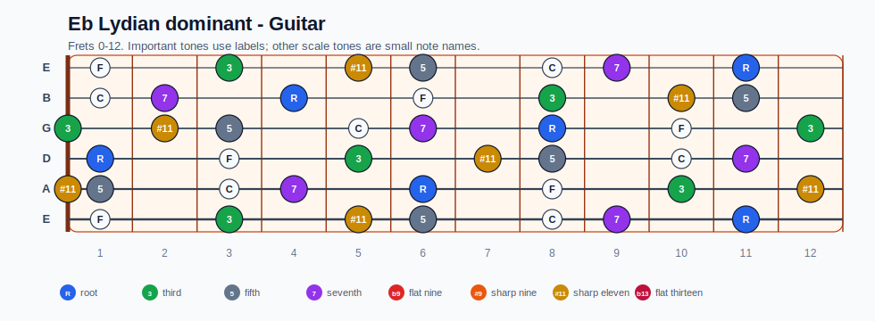
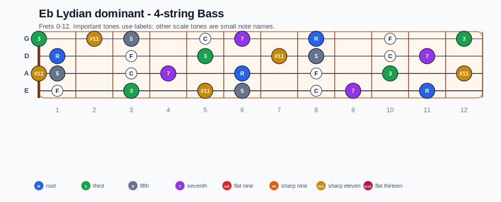
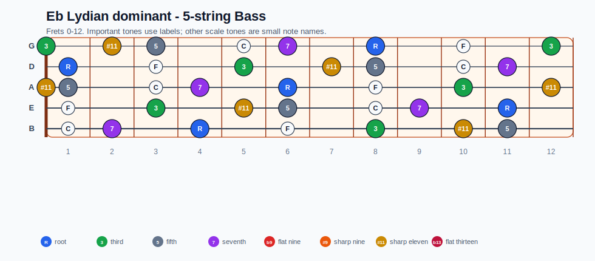
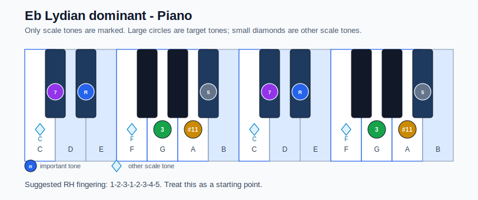

# Eb Lydian dominant Practice Sheet

## Scale

- Notes: Eb, F, G, A, Bb, C, Db, Eb
- Chord context: Eb7, Eb7
- Important tones: #11: A, 5: Bb, 7: Db, R: Eb, 3: G

### Common tones with previous scales

- Bb Aeolian: Eb, F, Bb, C, Db
- Bb Dorian: Eb, F, G, Bb, C, Db

### Common tones with next scales

- A Aeolian: F, G, A, C
- A Dorian: G, A, C

## Resolution ideas

- Lean on #11 color, then resolve the dominant guide tones smoothly.

## Diagrams

### Guitar fretboard

## Electric Bass

### 4-string bass

### 5-string bass

### Piano keyboard

## Piano notes

- Scale notes: Eb, F, G, A, Bb, C, Db, Eb
- Suggested RH fingering: 1-2-3-1-2-3-4-5
- Fingering is a starting point, not a rule. Adjust it for tempo, line direction, and hand shape.
- Target tones: #11: A, 5: Bb, 7: Db, R: Eb, 3: G
