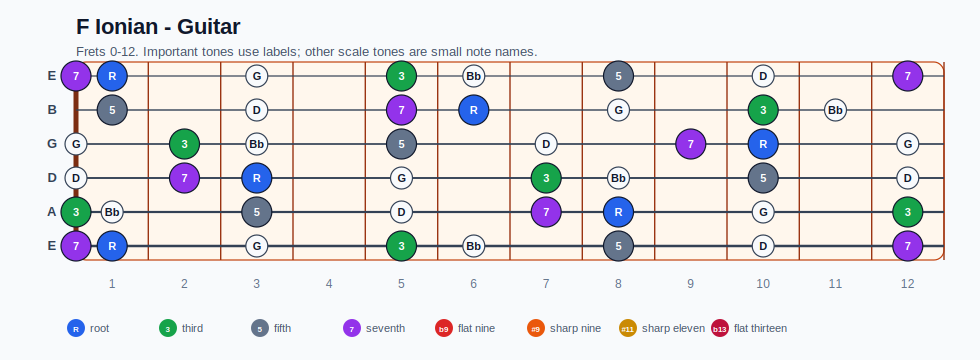
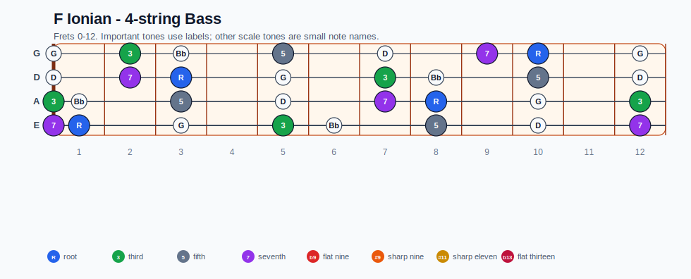
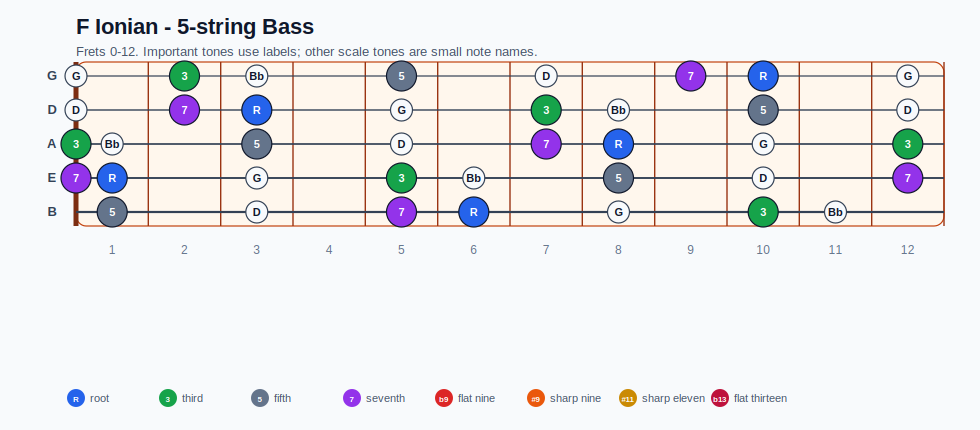
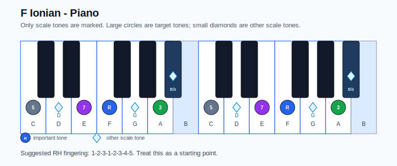

# F Ionian Practice Sheet

## Scale

- Notes: F, G, A, Bb, C, D, E, F
- Chord context: Fmaj7
- Important tones: 3: A, 5: C, 7: E, R: F

### Common tones with previous scales

- C Ionian: F, G, A, C, D, E
- C Lydian: G, A, C, D, E

### Common tones with next scales

- B Locrian: F, G, A, C, D, E
- B Locrian natural 2: F, G, A, D, E

## Resolution ideas

- Use 3rds and 7ths as landing tones, then connect neighboring scale notes melodically.

## Diagrams

### Guitar fretboard

## Electric Bass

### 4-string bass

### 5-string bass

### Piano keyboard

## Piano notes

- Scale notes: F, G, A, Bb, C, D, E, F
- Suggested RH fingering: 1-2-3-1-2-3-4-5
- Fingering is a starting point, not a rule. Adjust it for tempo, line direction, and hand shape.
- Target tones: 3: A, 5: C, 7: E, R: F
