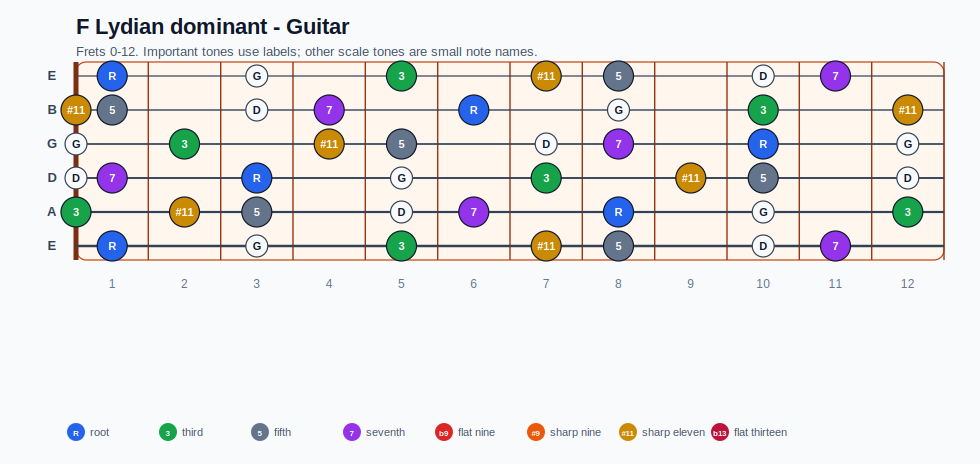
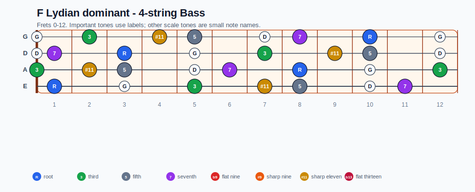
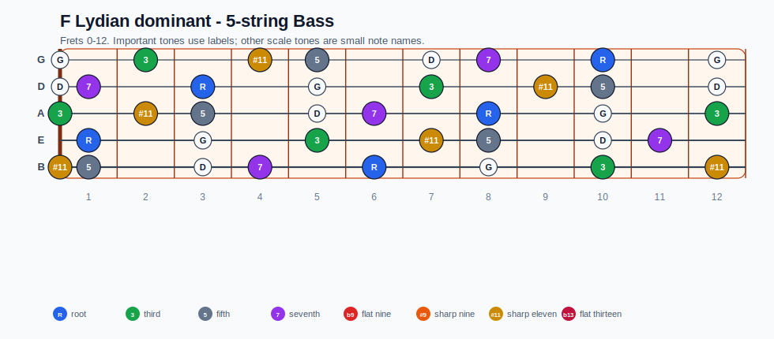
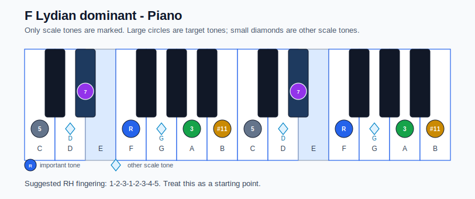

# F Lydian dominant Practice Sheet

## Scale

- Notes: F, G, A, B, C, D, Eb, F
- Chord context: F7, F7
- Important tones: 3: A, #11: B, 5: C, 7: Eb, R: F

### Common tones with previous scales

- C Aeolian: F, G, C, D, Eb
- C Dorian: F, G, A, C, D, Eb
- F# Locrian: G, A, B, C, D

### Common tones with next scales

- E Dorian: G, A, B, D
- G Ionian: G, A, B, C, D
- G Lydian: G, A, B, D

## Resolution ideas

- Lean on #11 color, then resolve the dominant guide tones smoothly.
- Move the substitute dominant by half step into the tonic root or 5th.

## Diagrams

### Guitar fretboard

## Electric Bass

### 4-string bass

### 5-string bass

### Piano keyboard

## Piano notes

- Scale notes: F, G, A, B, C, D, Eb, F
- Suggested RH fingering: 1-2-3-1-2-3-4-5
- Fingering is a starting point, not a rule. Adjust it for tempo, line direction, and hand shape.
- Target tones: 3: A, #11: B, 5: C, 7: Eb, R: F
