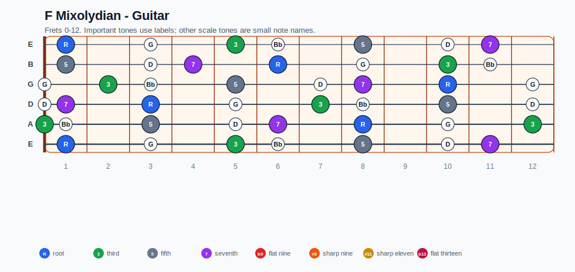
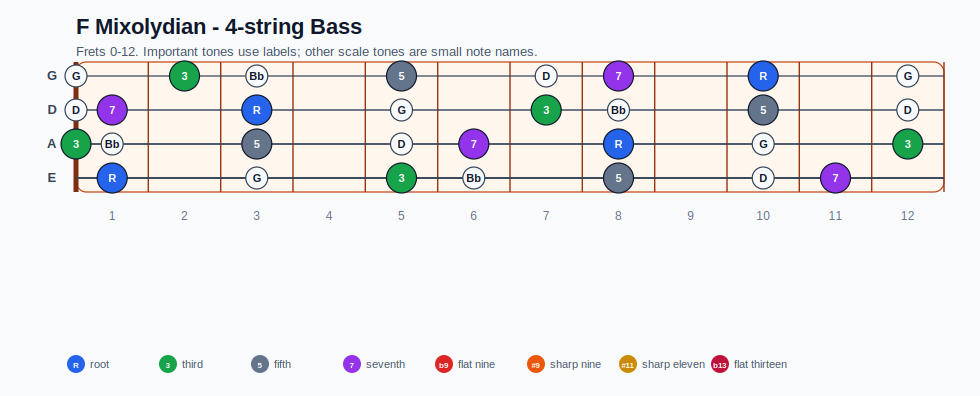
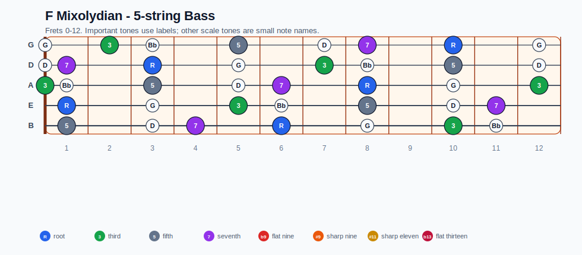
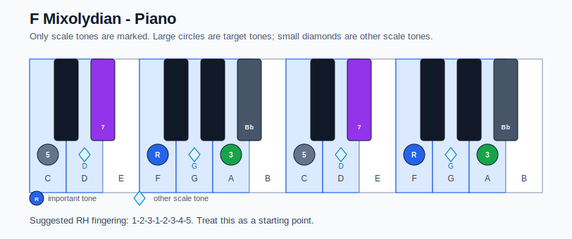

# F Mixolydian Practice Sheet

## Scale

- Notes: F, G, A, Bb, C, D, Eb, F
- Chord context: F7, F7
- Important tones: 3: A, 5: C, 7: Eb, R: F

### Common tones with previous scales

- C Aeolian: F, G, Bb, C, D, Eb
- C Dorian: F, G, A, Bb, C, D, Eb

### Common tones with next scales

- G Ionian: G, A, C, D
- G Lydian: G, A, D

## Resolution ideas

- Resolve the 7th down and the 3rd toward the next chord.

## Diagrams

### Guitar fretboard

## Electric Bass

### 4-string bass

### 5-string bass

### Piano keyboard

## Piano notes

- Scale notes: F, G, A, Bb, C, D, Eb, F
- Suggested RH fingering: 1-2-3-1-2-3-4-5
- Fingering is a starting point, not a rule. Adjust it for tempo, line direction, and hand shape.
- Target tones: 3: A, 5: C, 7: Eb, R: F
