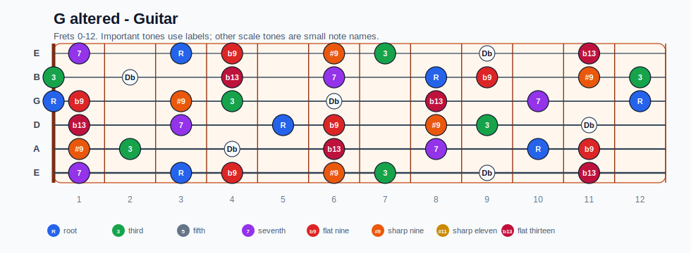
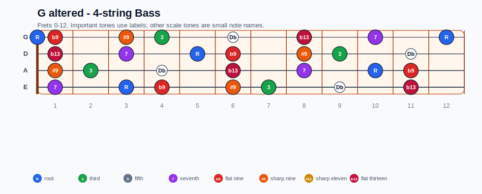
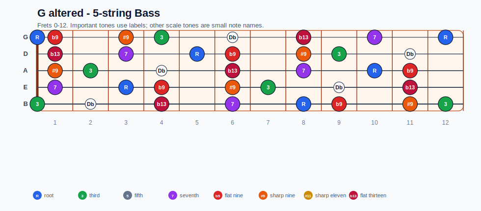
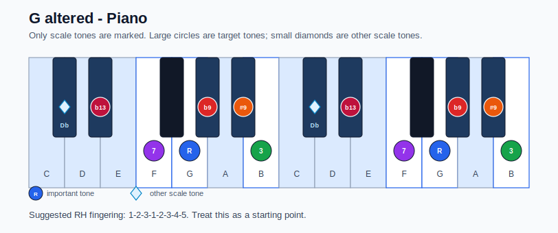

# G altered Practice Sheet

## Scale

- Notes: G, Ab, Bb, B, Db, Eb, F, G
- Chord context: G7#9
- Important tones: b9: Ab, 3: B, #9: Bb, b13: Eb, 7: F, R: G

### Common tones with previous scales

- D Dorian: G, B, F

### Common tones with next scales

- C Ionian: G, B, F

## Resolution ideas

- Resolve #9/b9 colors by half step into stable chord tones on the tonic.

## Diagrams

### Guitar fretboard

## Electric Bass

### 4-string bass

### 5-string bass

### Piano keyboard

## Piano notes

- Scale notes: G, Ab, Bb, B, Db, Eb, F, G
- Suggested RH fingering: 1-2-3-1-2-3-4-5
- Fingering is a starting point, not a rule. Adjust it for tempo, line direction, and hand shape.
- Target tones: b9: Ab, 3: B, #9: Bb, b13: Eb, 7: F, R: G
