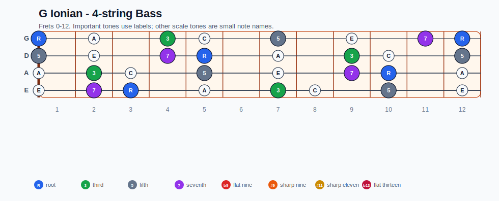
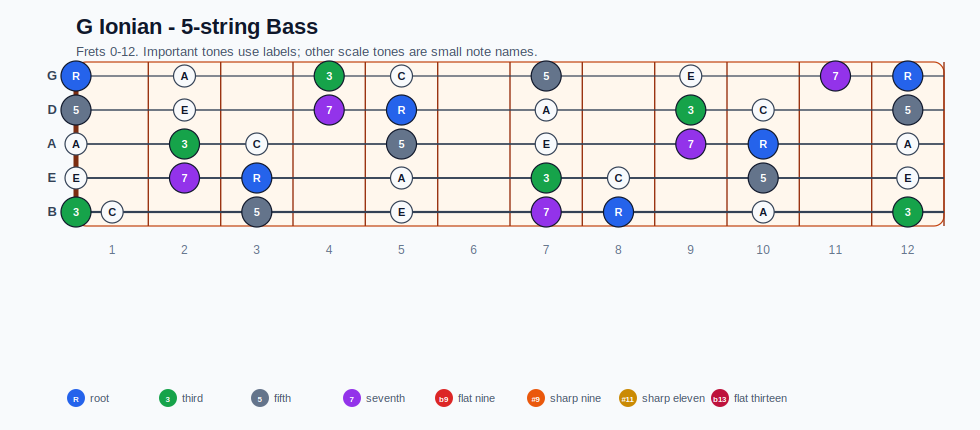

# G Ionian Practice Sheet

## Scale

- Notes: G, A, B, C, D, E, F#, G
- Chord context: Gmaj7, Gmaj7, Gmaj7, Gmaj7, Gmaj7, G6
- Important tones: 3: B, 5: D, 7: F#, R: G

### Common tones with previous scales

- Ab Lydian dominant: C, D, F#
- D Lydian dominant: A, B, C, D, E, F#
- D Mixolydian: G, A, B, C, D, E, F#
- D altered: C, D, F#
- D half-whole diminished: A, B, C, D, F#
- F Lydian dominant: G, A, B, C, D
- F Mixolydian: G, A, C, D
- G Ionian: G, A, B, C, D, E, F#
- G Lydian: G, A, B, D, E, F#

### Common tones with next scales

- Bb Aeolian: C, F#
- Bb Dorian: G, C
- D Aeolian: G, A, C, D, E
- D Dorian: G, A, B, C, D, E
- E Aeolian: G, A, B, C, D, E, F#
- E Dorian: G, A, B, D, E, F#
- G Ionian: G, A, B, C, D, E, F#
- G Lydian: G, A, B, D, E, F#

## Resolution ideas

- Use 3rds and 7ths as landing tones, then connect neighboring scale notes melodically.

## Diagrams

### Guitar fretboard

## Electric Bass

### 4-string bass

### 5-string bass

### Piano keyboard

## Piano notes

- Scale notes: G, A, B, C, D, E, F#, G
- Suggested RH fingering: 1-2-3-1-2-3-4-5
- Fingering is a starting point, not a rule. Adjust it for tempo, line direction, and hand shape.
- Target tones: 3: B, 5: D, 7: F#, R: G
