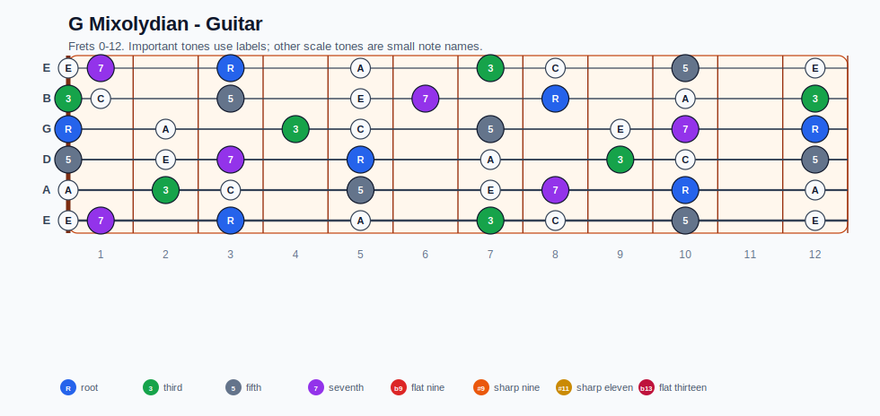
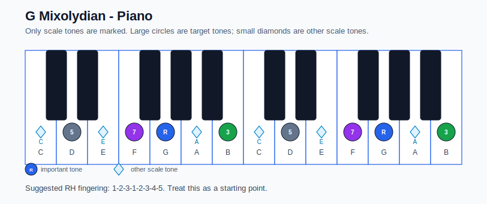

# G Mixolydian Practice Sheet

## Scale

- Notes: G, A, B, C, D, E, F, G
- Chord context: G7, G7
- Important tones: 3: B, 5: D, 7: F, R: G

### Common tones with previous scales

- D Aeolian: G, A, C, D, E, F
- D Dorian: G, A, B, C, D, E, F

### Common tones with next scales

- C Ionian: G, A, B, C, D, E, F
- C Lydian: G, A, B, C, D, E

## Resolution ideas

- Keep guide tones clear: the dominant 7th resolves down, and the dominant 3rd resolves toward the tonic.
- Resolve the 7th down and the 3rd toward the next chord.

## Diagrams

### Guitar fretboard

### Piano keyboard

## Piano notes

- Scale notes: G, A, B, C, D, E, F, G
- Suggested RH fingering: 1-2-3-1-2-3-4-5
- Fingering is a starting point, not a rule. Adjust it for tempo, line direction, and hand shape.
- Target tones: 3: B, 5: D, 7: F, R: G
