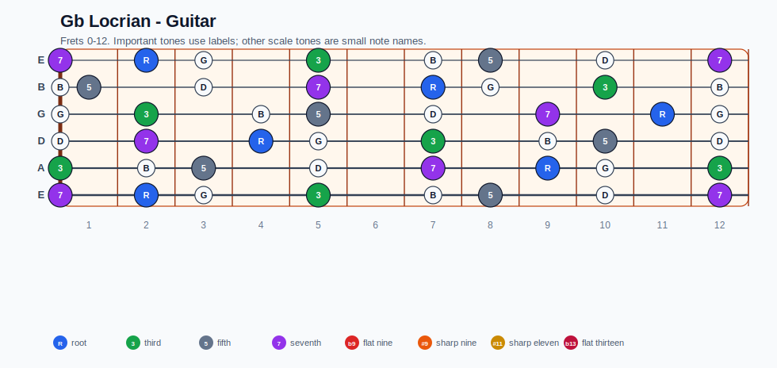
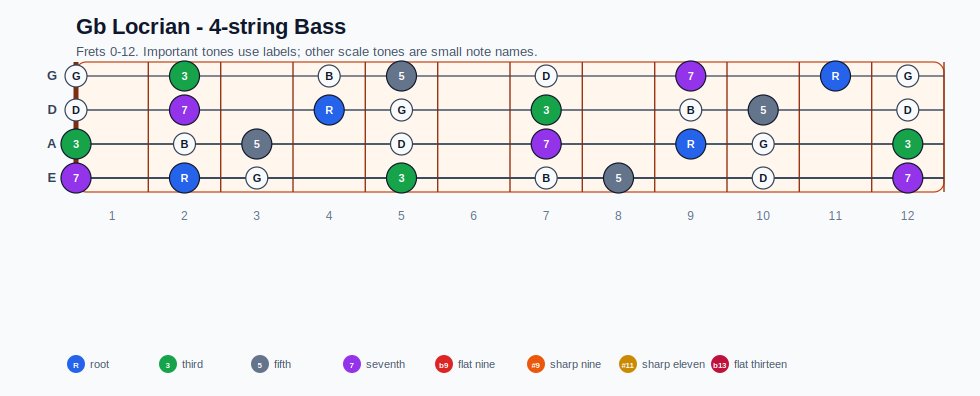
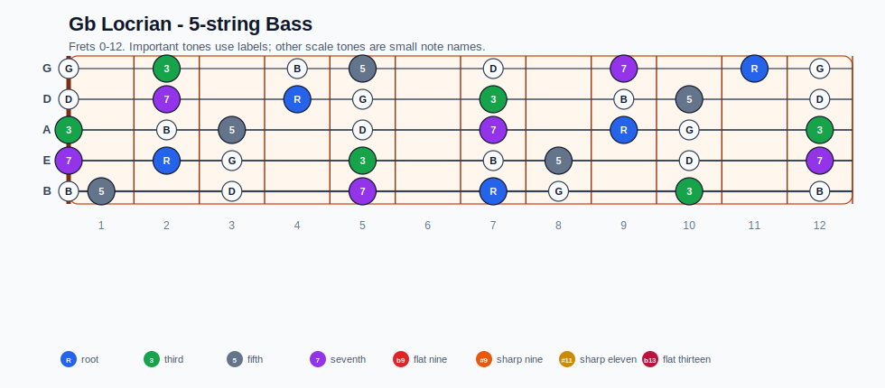
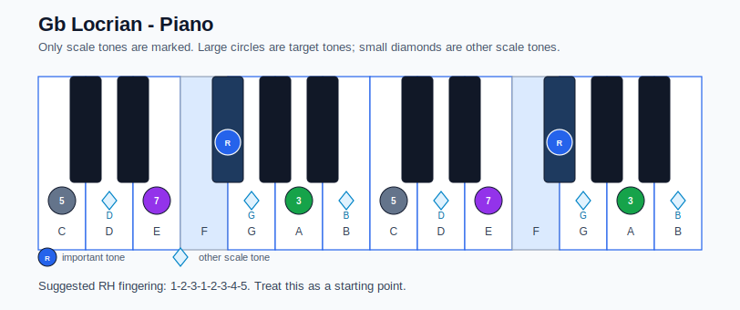

# Gb Locrian Practice Sheet

## Scale

- Notes: Gb, G, A, B, C, D, E, Gb
- Chord context: F#m7b5
- Important tones: 3: A, 5: C, 7: E, R: Gb

### Common tones with previous scales

- D Lydian dominant: Gb, A, B, C, D, E
- D Mixolydian: Gb, G, A, B, C, D, E

### Common tones with next scales

- B altered: G, A, B, C, D
- B half-whole diminished: Gb, A, B, C, D
- B phrygian dominant: Gb, G, A, B, C, E
- F Lydian dominant: G, A, B, C, D

## Resolution ideas

- Use 3rds and 7ths as landing tones, then connect neighboring scale notes melodically.

## Diagrams

### Guitar fretboard

## Electric Bass

### 4-string bass

### 5-string bass

### Piano keyboard

## Piano notes

- Scale notes: Gb, G, A, B, C, D, E, Gb
- Suggested RH fingering: 1-2-3-1-2-3-4-5
- Fingering is a starting point, not a rule. Adjust it for tempo, line direction, and hand shape.
- Target tones: 3: A, 5: C, 7: E, R: Gb
